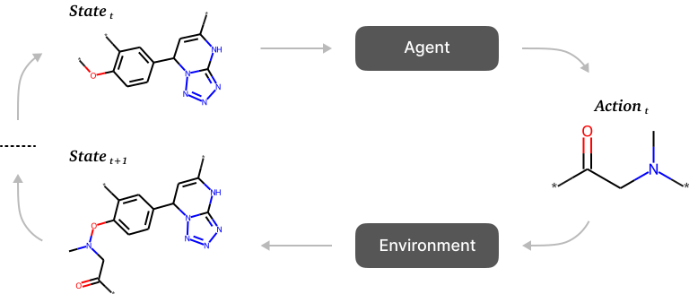

# FREED++

This repository is the official Pytorch implementation of "FREED++: Improving RL Agents for Fragment-Based Molecule Generation by Thorough Reproduction".




## Installation
### Dependency
The codes have been tested in the following environment:
Package  | Version
--- | ---
Python | 3.7.12
PyTorch | 1.12.1
TorchVision | 0.13.1
CUDA | 11.3.1
DGL | 0.9.1.post1
RDKit | 2020.09.1.0

### Install via conda yaml file
```bash
conda env create -f environment.yml
conda activate ffreed
```

### Install via Dockerfile
```bash
docker build -t ffreed .
docker run -it --name ffreed -v /home/user/freed:/home/jovyan --gpus device=0 ffreed
```

## Training
### FREED++
```bash
python main.py \
    --exp_root /home/user/freed/experiments \
    --alert_collections /home/user/freed/data/alert_collections.csv \
    --fragments /home/user/freed/data/motifs/zinc_crem.json \
    --receptor /home/user/freed/data/receptors/protein.pdbqt \
    --vina_program /home/user/freed/utils/qvina02 \
    --starting_smile "c1([*:1])c([*:2])ccc([*:3])c1" \
    --fragmentation crem \
    --num_sub_proc 12 \
    --n_conf 1 \
    --exhaustiveness 1 \
    --save_freq 50 \
    --epochs 200 \
    --commands "train,sample" \
    --reward_version soft \
    --box_center "x1,x2,x3" \
    --box_size "s1,s2,s3" \
    --seed 150 \
    --name freedpp
```
### FFREED
```bash
python main.py \
    --exp_root /home/user/freed/experiments \
    --alert_collections /home/user/freed/data/alert_collections.csv \
    --fragments /home/user/freed/data/motifs/zinc_crem.json \
    --receptor /home/user/freed/data/receptors/protein.pdbqt \
    --vina_program /home/user/freed/utils/qvina02 \
    --starting_smile "c1([*:1])c([*:2])ccc([*:3])c1" \
    --fragmentation crem \
    --num_sub_proc 12 \
    --n_conf 1 \
    --exhaustiveness 1 \
    --save_freq 50 \
    --epochs 200 \
    --commands "train,sample" \
    --reward_version soft \
    --box_center "x1,x2,x3" \
    --box_size "s1,s2,s3" \
    --seed 150 \
    --name ffreed \
    --action_mechanism sfps \
    --per True \
    --merger mi
```
We recommend to specify `timeout_dock` and `timeout_gen3d` parameters, since unconstrained usage of OpenBabel and Qvina2 may slowdown training.

## Evaluation
```bash
python main.py \
    --exp_root /home/user/freed/experiments \
    --alert_collections /home/user/freed/data/alert_collections.csv \
    --fragments /home/user/freed/data/motifs/zinc_crem.json \
    --receptor /home/user/freed/data/receptors/protein.pdbqt \
    --vina_program /home/user/freed/utils/qvina02 \
    --starting_smile "c1([*:1])c([*:2])ccc([*:3])c1" \
    --fragmentation crem \
    --num_sub_proc 12 \
    --n_conf 3 \
    --exhaustiveness 8 \
    --save_freq 50 \
    --epochs 200 \
    --commands "evaluate" \
    --reward_version soft \
    --box_center "x1,x2,x3" \
    --box_size "s1,s2,s3" \
    --seed 150 \
    --timeout_dock 90 \
    --timeout_gen3d 30 \
    --name ffreed
```

## Citation
To cite this work, please use:
```
@article{
telepov2023freed,
title={{FREED}++: Improving {RL} Agents for Fragment-Based Molecule Generation by Thorough Reproduction},
author={Alexander Telepov and Artem Tsypin and Kuzma Khrabrov and Sergey Yakukhnov and Pavel Strashnov and Petr Zhilyaev and Egor Rumiantsev and Daniel Ezhov and Manvel Avetisian and Olga Popova and Artur Kadurin},
journal={Transactions on Machine Learning Research},
issn={2835-8856},
year={2023},
url={https://openreview.net/forum?id=YVPb6tyRJu},
note={}
}
```